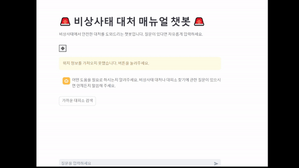
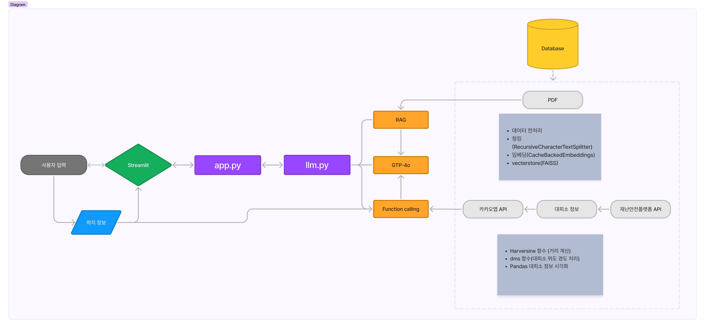

<div align="left">           </div>

# **🚨[비상사태 매뉴얼 챗봇]**

</br>

## 🌟 **프로젝트 소개**
> 이 프로젝트는 비상사태 상황에서 시민들에게 빠르고 정확한 정보를 제공하기 위해 개발되었습니다.
> 💡 **주요 목표**: 비상사태 입력 시 시민들에게 신속하게 정확도가 높은 매뉴얼 소개, 사용자의 위치 정보를 기반으로 가장 가까운 대피소의 위치 안내
궁극적으로 각종 재난에 대한 대처를 용이하게 만들고자 함



</br>

## 🎯 프로젝트 핵심 목표


- **비상사태 대책**
  - 전쟁, 가뭄, 화재, 지진 등 다양한 비상사태에 대한 대처 방안 신속하게 제공.
- **위치 기반 대피소 안내**
  - 카카오맵 API로 위치 기반 서비스(LBS)를 구현해 사용자 위치를 기반으로 가장 가까운 대피소를 실시간으로 안내.
- **PDF RAG**
  - LLM, RAG를 이용하여 비상사태 대피 매뉴얼을 학습하는 기능 구현, 자연어 질의에 기반한 정확한 답변 제공.

</br>

## 📝 효율성 개선 및 주요 문제 해결


### 성능 개선

실행할 때마다 `PyPDFLoader`로 파일을 불러와 전처리를 진행한 결과 실행이 느려지고 API 호출 비용이 자꾸 발생하는 것을 확인했습니다.

이를 해결하기 위해 **캐시를 지원하는 임베딩 기법**을 도입하고 전처리된 Loader 파일을 저장해서 불러오는 형식으로 해결했습니다.

### 트러블슈팅

<details>
<summary><strong>function calling 사용 시 해당 함수에서 응답을 내고 나머지 질문에 대답하지 못하고 종료</strong></summary>

**문제**: 함수 호출을 사용했을 때 반환한 결과를 그대로 응답하고 나머지 질문에는 대답을 못하는 문제가 발생했습니다.

예를 들어:

> **User**: 서울시청역이야, 비상상황 대처 매뉴얼을 알려줘.
>
> **Assistant**: 서울시청역 근처 대피소 정보만 반환하고 비상상황 대처 매뉴얼에는 응답하지 않고 대답이 종료되었습니다.

1. **함수 호출 및 응답 저장 프로세스**

   - **문제**: 함수 호출 후 반환된 `arguments`가 문자열(JSON) 또는 딕셔너리일 수 있어 처리 방식이 달라야 합니다.
   - **해결**: 반환값의 타입을 확인하여 파싱 과정을 다르게 처리했습니다.

2. **파싱과 데이터 저장의 이유**

   - **문제**: 함수의 반환 데이터를 모델이 다시 사용할 수 있도록 대화 기록에 저장했습니다.
   - **해결**: `FunctionMessage`를 생성하고 이를 대화 기록에 추가했습니다.

3. **저장된 데이터를 모델에 재사용**

   - **문제**: 함수 호출 후 모델이 대화 흐름을 이어가려면, 함수 응답이 필요합니다.
   - **해결**: 대화 기록을 모델에 전달해 새로운 응답을 생성합니다.

</details>

<details>
<summary><strong>Streamlit 호출 로딩 속도</strong></summary>


- **문제**: 실행할 때마다 `PyPDFLoader`로 파일을 불러와 전처리를 진행한 결과 실행이 느려지고 비용이 발생하는 것을 확인했습니다.
- **해결**: 전처리된 Loader 파일을 저장해서 불러오는 형식으로 해결했습니다.

</details>


</br>

## 📌 인프라 아키텍처 및 적용 기술


### 인프라 아키텍처



1. **사용자 인터페이스**: `Streamlit` 기반으로 사용자 입력 및 결과 표시

2. **백엔드 API**

   - OpenAI GPT 모델: 자연어 이해 및 처리
   - 카카오 지도 API: 위치 기반 검색
   - 재난안전플랫폼 API: 대피소 23,000개 정보 호출

3. **데이터 레이어**

   - PDF 데이터 파싱(`PyPDFLoader`)
   - 로컬 JSON 데이터(대피소 정보)

4. **데이터베이스**

   - `FAISS`: 유사도 검색 엔진
   - `Local File Store`: 캐싱된 임베딩 저장

5. **배포 환경**

   - 로컬 개발 및 Streamlit 서비스, 데모 테스트용 `ngrok` 사용 (추후 AWS, GCP 고려)

### 적용 기술

<details>
<summary><strong>LLM</strong></summary>

OpenAI의 GPT-4 API를 이용하여 사용자의 자연어 질의에 자동으로 응답을 생성해 출력하는 기능 구현

답변을 생성할 때 RAG, Function Calling을 이용해 비상 상황에 대한 대처 방법 또는 입력 위치에 따라 가장 가까운 대피소 위치 정보를 반환받아 답변 생성에 사용

사용된 시스템 프롬프트:

```python
chat_template = ChatPromptTemplate.from_messages(
    [
        ("system", (
            "당신은 비상사태 대처 매뉴얼 전문 챗봇입니다. "
            "재난 상황(지진, 화재, 홍수, 전쟁 등)이 발생했을 때 사용자가 안전하게 대피할 수 있도록 최적의 정보를 제공하는 것이 목표입니다.\n\n"
            "제공된 컨텍스트와 일반 상식을 사용해서, 질문에 답변하세요."
            "위도 경도 형태로 사용자 위치가 제공될 수 있습니다"
            "아래의 지침에 따라 응답하세요:\n"
            "1. 역할 정의: 사용자에게 신뢰할 수 있는 정보를 제공하고, 필요한 경우 함수 호출을 통해 가장 가까운 대피소를 추천하세요.\n"
            "2. 대화 스타일: 간결하고 명확하며 사용자 친화적인 언어를 사용하고, 긴급 상황에 맞는 전문적인 톤을 유지하세요.\n"
            "3. 긴급 연락처: 추가적인 도움이 필요할 경우 즉시 긴급 연락처(예: 119, 112)를 안내하세요.\n"
            "4. 정보의 정확성과 최신성: 최신 데이터를 결합해 응답하세요. 데이터 부족 시 안전한 방향으로 안내하고 추가 도움을 요청하도록 권장하세요.\n"
            "5. 함수 호출 지침: 대피소 검색이나 위치 관련 질문에 적절한 함수를 호출하여 데이터를 검색하세요.\n"
            "6. 다양한 사용자 고려: 복잡한 용어 대신 쉬운 표현을 사용하세요.\n"
            "7. 추가 지침: 필요한 경우 질문을 되묻고, 제공 정보가 명확한지 점검하세요."
        )),
        ("human", "안녕하세요!"),
        ("ai", "안녕하세요! 저는 비상사태에서 안전한 대처를 도와드리는 전문 AI 챗봇입니다. 무엇을 도와드릴까요?"),
        ("human", "{user_input}"),
    ]
)

```

</details>

<details><summary><strong>RAG</strong></summary>
PDF와 재난안전데이터공유플랫폼에서 가져온 API에서 대응법을 학습해 VectorDB에 임베딩된 데이터를 저장, 사용자의 질문에 관련된 데이터를 검색해 결과 데이터를 LLM에 전달해 정확도 높은 답변 생성<br>
대피소의 위치 데이터의 경우, 제공되는 API의 한계로 인해 등록된 IP 외에는 API의 사용이 불가하여 SourceCode 디렉토리 안에 API로부터 응답받은 json파일이 미리 저장되어 있다.<br>
재난 상황에 대한 사용자의 질문을 받아 자연어 질의에 기반한 정확한 답변 제공 <br></br>

사전에 전처리된 데이터가 preprocessed_data_path 변수가 지정하는 디렉토리에 저장되어 있다면 API 호출 비용을 아끼기 위해 저장되어있던 전처리된 데이터를 사용
preprocessed_data_path의 디폴트값은 'SourceCode/preprocessed_docs.pkl'이다. 

필요없는 텍스트를 줄이기 위해 다음의 전처리 과정을 수행: 
- "비상시 국민행동요령 알아야 안전하다"로 시작한다면 제거
- 특정 패턴이 시작 부분에 있으면 제거
- 기타 불필요한 줄바꿈, 공백, 특수문자 정리

각 전처리가 끝난 데이터는 preprocessed_data_path 디렉토리에 저장됨
전처리가 끝난 데이터는 임베딩되어 VectorDB에 저장

FAISS와 Pandas를 이용해 벡터DB 구현 
캐시 지원 임베딩, OpenAI 임베딩 모델(text-embedding-3-small) 사용
</details>

<details><summary><strong>위치 기반 서비스 (LBS)</strong></summary>
카카오맵 API를 이용하여 검색한 위치의 경도와 위도를 반환함<br>
function calling을 통해서 현재 위치에서 가장 가까운 대피소 위치 반환

(대피소 위치정보의 경우 API의 한계로 정해진 IP 외에는 API로부터 응답을 받을 수 없어 Source 디렉토리에 미리 API의 응답 패킷인 shelters.json을 저장해두었다.)
대피소 위치정보의 전처리 과정은 다음과 같다: 
- DMS를 소수점 좌표로 변환, 위도와 경도에 각각 수행
- 시설명, 주소, 위도, 경도를 제외한 불필요한 데이터 정리

<details><summary><strong>get_coordinates(query)</strong></summary>
카카오 API를 호출해 사용자가 입력한 주소를 검색, 검색결과가 없을 경우 키워드를 이용해 주소 검색
검색한 주소의 좌표 반환
</details>

<details><summary><strong>haversine_distance(lat1, lon1, lat2, lon2)</strong></summary>
두 장소의 위도와 경도를 받아 두 지점 사이의 거리를 킬로미터 단위로 계산
</details>

<details><summary><strong>find_nearest_shelters(latitude, longitude, address) -> str</strong></summary>
주어진 위도와 경도 또는 주소를 기준으로 가장 가까운 대피소 검색
만약 사용자가 입력으로 주소를 주었을 경우 해당 주소를 좌표로 전환

- <b>calculate_distance(row)</b>: 
전처리된 데이터프레임의 각 행에 haversine_distance()를 적용해 사용자의 위치와 대피소의 거리를 계산하는 함수

계산된 거리 중 null이 아닌 값만 유효한 값으로 취급해 유효하지 않은 값은 이후의 과정에서 배제한다. 
남은 대피소 중 거리 기준으로 정렬해 상위 3개만 선택해 결과 문자열을 생성하고 LLM으로 전달한다.  
</details>

</details>

</br>

## 🔍 **주요 기능**


### 1. **데이터 수집 및 전처리**  
   - 재난안전플랫폼, 카카오맵 등 다양한 플랫폼에서 API를 활용해 실시간 데이터를 수집. 
   - 재해/재난 상황 대처 매뉴얼, 대피소 위치 정보 등 수집된 데이터를 전처리하여 효과적으로 사용.

### 2. **PDF RAG 활용**  
   - 비상상황 대피 매뉴얼 PDF를 Retrieval-Augmented Generation (RAG) 방식으로 학습하여 사용자의 질의에 재해/재난 상황 대처 매뉴얼을 답변으로 제공.

### 3. **위치 기반 서비스 (LBS)**  
   - 사용자 입력 주소를 기준으로, 데이터 내 대피소와의 거리를 계산.  
   - 가장 가까운 대피소를 상세히 안내(주소, 거리, 지도 링크).

### ~~4. 대화 기록 저장 및 처리~~
(민감한 정보인 사용자 위치를 포함하여, 대화 기록 저장을 하지 않음)


</br>

## 👩‍💻 **팀원 소개**
<details>
<summary><strong>팀원 역할 및 담당 파트 보기</strong></summary>

>### 🧑 **박성규(팀장)**
- **담당 파트:** function calling 설계, 프론트엔드 구현(streamlit 기반 챗봇 인터페이스)
- **역할:** SA문서 관리, 발표 🎤  
- [GitHub 링크](https://github.com/PSG4160)

>### 👨‍💻 **김광림**
- **담당 파트:** api 데이터 수집, system_prompt 작성, 음성 입출력 기능 설계, Query_Decomposition 설계, 시연 영상 제작
- **역할:** 시연영상 🎥  
- [GitHub 링크](https://github.com/bgt30)

>### 👨‍🔬 **조현민**
- **담당 파트:** 데이터 수집, 데이터 전처리 
- **역할:** SA 문서관리 📄  
- [GitHub 링크](https://github.com/ddangddang-e)

>### 👨‍💻 **정윤우**
- **담당 파트:** 데이터 수집(PDF매뉴얼, API 데이터), LLM_RAG
- **역할:** README 작성📝  
- [GitHub 링크](https://github.com/mireuk-git)

>### 👨‍💻 **최해찬**
- **담당 파트:** 데이터 전처리, function calling 설계 및 구현  
- **역할:** jira workflow, PPT 제작🖼️  
- [GitHub 링크](https://github.com/choi-sun1)

<details>
<summary><strong>999조 그라운드룰 조회하기</strong></summary>

<details>
<summary><strong>Git 관련 작업 시 준수해야 할 규칙입니다.</strong></summary>

### 기본 규칙

1. **작업 시작 전 최신 상태 동기화**  
   항상 작업 전 `git fetch origin`을 통해 원격 저장소의 최신 정보를 동기화합니다.

2. **개인 브랜치에서 작업**  
   각자 자신의 브랜치에서 작업하며, 다른 조원의 브랜치를 수정하지 않도록 유의하세요.

3. **Merge 규칙**  
   main 브랜치로 Merge 시, Pull Request에서 **최소 1명**의 조원 확인(Review Approval)을 받아야 합니다.

4. **충돌 해결**  
   충돌이 발생한 경우, 팀원 간 충분히 공유하여 협업으로 문제를 해결합니다.

5. **위 내용과 더불어 플로우 로직이 이해가 쉽도록 작성 부탁드립니다.**

### 회의 규칙

1. 특별한 일이 없다면, 오전 10시와 오후4시에 회의 진행
2. 특강 등 일정이 있어 앞서 정한 시간에 회의를 진행할 수 없다면, 임의로 회의시간을 정해서 회의 진행

</details>

</details>

</details>

</br>

## **성과 및 회고**


### **프로젝트의 성과**
AI_8기 부트캠프 기준으로 팀 과제가 아닌, 가이드라인 없이 주제부터 만든 첫 팀 프로젝트로, 다른 개발자들과 함께 프로젝트를 진행하는 경험을 쌓을 수 있는 계기가 되었다. <br>
LLM, RAG, Langchain 등 이번 프로젝트에서 사용되었던 챗봇과 관련된 기술의 활용법과 function calling 부분에 대한 이해도가 높아질 수 있었다. 

### **개선 목표**
재난안전플랫폼에서 제공한 API는 이용신청할 때 입력된 IP가 아니면 API 호출 응답을 받을 수 없어 다수의 사용자가 실시간으로 API를 통해 새로운 정보를 받을 수 없다는 한계가 존재한다. <br>
경험과 시간 부족으로 추가하지 못한 새로운 기능을 추가하기
- 더 많은 API 데이터 추가
- 실시간으로 API에서 데이터를 받아 작동하는 재난 알림
- 음성 인식 및 출력 