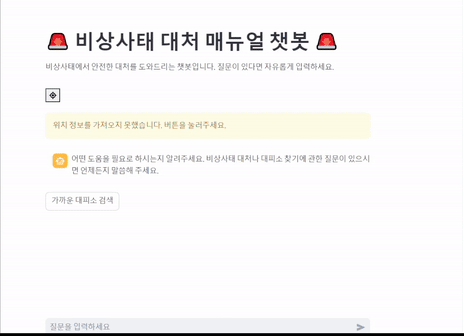

  
  
  
  

# **🚨[비상사태 매뉴얼 챗봇]**
## 🌟 **프로젝트 소개**
> 이 프로젝트는 비상사태 상황에서 시민들에게 빠르고 정확한 정보를 제공하기 위해 개발되었습니다.
> 💡 **주요 목표**: 비상사태 입력 시 시민들에게 신속하게 정확도가 높은 매뉴얼 소개, 사용자의 위치 정보를 기반으로 가장 가까운 대피소의 위치 안내
궁극적으로 각종 재난에 대한 대처를 용이하게 만들고자 함

## 🎯**프로젝트 핵심 목표**
- **비상사태 대책**
  - 전쟁, 가뭄, 화재, 지진 등 다양한 비상사태에 대한 대처 방안 신속하게 제공.
- **위치 기반 대피소 안내**  
  - 카카오맵 API로 위치 기반 서비스(LBS)를 구현해 사용자 위치를 기반으로 가장 가까운 대피소를 실시간으로 안내.
- **PDF RAG**  
  - LLM, RAG를 이용하여 비상사태 대피 매뉴얼을 학습하는 기능 구현, 자연어 질의에 기반한 정확한 답변 제공.

## 📝 **프로젝트 개요**
**성능 개선**
어느 부분에서 성능개선이 이루어졌는지?
before&after 수치/시각적으로 표현
**트러블슈팅**

---

## 인프라 아키텍쳐 & 적용기술

### 적용 기술

<strong>LLM</strong>

OpenAI의 LLM API를 이용하여 재난상황 대응 pdf를 학습
재난 상황에 대한 사용자의 

<strong>RAG</strong>

PDF와 재난안전데이터공유플랫폼에서 가져온 API에서 대

<strong>위치 기반 서비스 (LBS)</strong>

카카오맵 API를 이용하여 검색한 위치의 경도와 위도를 반환함

## 🔍 **주요 로직**
### 1. **데이터 수집 및 전처리**  
   - 재난안전플랫폼, 카카오맵 등 다양한 플랫폼에서 API를 활용해 실시간 데이터를 수집. 
   - 수집된 데이터를 전처리하여 효과적으로 사용.

### 2. **PDF RAG 활용**  
   - 비상상황 대피 매뉴얼 PDF를 Retrieval-Augmented Generation (RAG) 방식으로 학습하여 답변 제공.

### 3. **위치 기반 서비스 (LBS)**  
   - 사용자 입력 주소를 기준으로, 데이터 내 대피소와의 거리를 계산.  
   - 가장 가까운 대피소를 안내.

### 4. **추가 가능 기능**  
   - 실시간 재난 알림.  
   - 사용자 맞춤형 경고 메시지.  

## 기술적 고도화

프로젝트 진행하면서 했던 고민 작성

## 👩‍💻 **팀원 소개**

<strong>팀원 역할 및 담당 파트 보기</strong>

>### 🧑 **박성규(팀장)**
- **담당 파트:** function calling 설계, 프론트엔드 구현(streamlit 기반 챗봇 인터페이스)
- **역할:** SA문서 관리, 발표 🎤  
- [GitHub 링크](https://github.com/PSG4160)

>### 👨‍💻 **김광림**
- **담당 파트:** api 데이터 수집, system_prompt 작성, 음성 입출력 기능 설계, Query_Decomposition 설계, 시연 영상 제작
- **역할:** 시연영상 🎥  
- [GitHub 링크](https://github.com/bgt30)

>### 👨‍🔬 **조현민**
- **담당 파트:** 데이터 수집, 데이터 전처리 
- **역할:** SA 문서관리 📄  
- [GitHub 링크](https://github.com/ddangddang-e)

>### 👨‍💻 **정윤우**
- **담당 파트:** 데이터 수집(PDF매뉴얼, API 데이터), LLM_RAG
- **역할:** README 작성📝  
- [GitHub 링크](https://github.com/mireuk-git)

>### 👨‍💻 **최해찬**
- **담당 파트:** LLM_RAG  
- **역할:** PPT 제작🖼️  
- [GitHub 링크](https://github.com/)

<strong>999조 그라운드룰 조회하기</strong>

<strong>Git 관련 작업 시 준수해야 할 규칙입니다.</strong>

### 기본 규칙

1. **작업 시작 전 최신 상태 동기화**  
   항상 작업 전 `git fetch origin`을 통해 원격 저장소의 최신 정보를 동기화합니다.

2. **개인 브랜치에서 작업**  
   각자 자신의 브랜치에서 작업하며, 다른 조원의 브랜치를 수정하지 않도록 유의하세요.

3. **Merge 규칙**  
   main 브랜치로 Merge 시, Pull Request에서 **최소 1명**의 조원 확인(Review Approval)을 받아야 합니다.

4. **충돌 해결**  
   충돌이 발생한 경우, 팀원 간 충분히 공유하여 협업으로 문제를 해결합니다.

5. **위 내용과 더불어 플로우 로직이 이해가 쉽도록 작성 부탁드립니다.**

### 회의 규칙

1. 특별할 일

